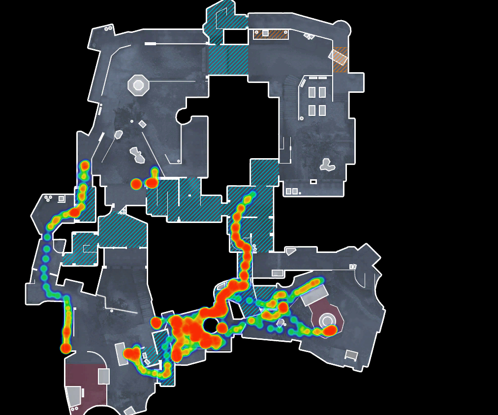

CS:GO Heatmaps Library
----------------------

Example:




Usage:

```html
<div id="container">
<canvas id="canvas" width="1024" height="1024"></canvas>
</div>
<script src="de_heatmp.js"> </script>
<script type="text/javascript">
  // Create heatmap, passing map name and array of csgo coordinates
  // This puts a very strong point right on the lavatories on cobble
  var points_array = [[-252, 668, 94]];
  // Note the point weight in the options argument, you'll want to eliminate this or
  // drop it to 2
  var options = { point_weight: 18 };
  var heatmap = new de_heatmp( "canvas", "de_cbble", points_array, options );
  // Draw heatmap
  heatmap.draw();
</script>
```


This allows placing of a csgo minimap and easy heatmap overlay on top of that.


This uses [simpleheat](https://github.com/mourner/simpleheat), a super-tiny JavaScript library for drawing heatmaps with Canvas. Inspired by heatmap.js, but with focus on simplicity and performance.

This uses [simpleradar](http://www.simpleradar.com/), some excellent minimap/radar images for csgo maps.
